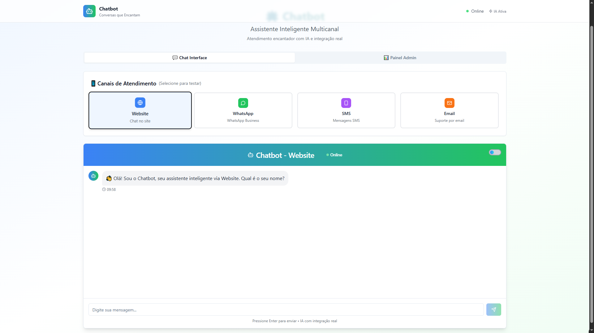
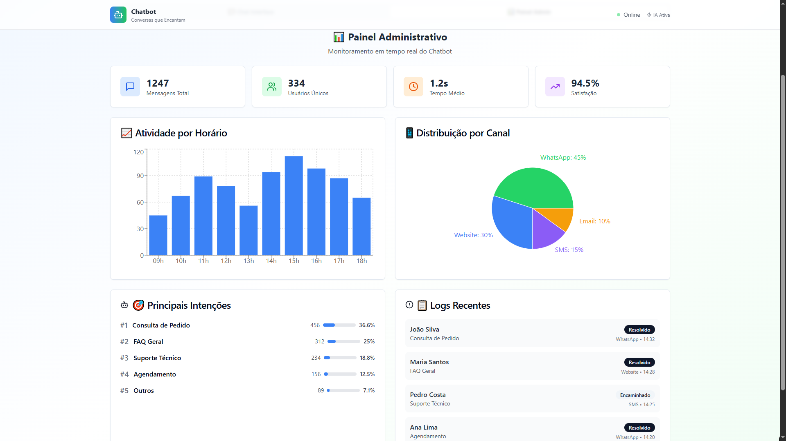

# 🤖 Chatbot Conversations Alive

Um chatbot inteligente e moderno com interface web responsiva, desenvolvido com foco em experiência do usuário, simulação multicanal e recursos básicos de processamento de linguagem natural. O projeto foi construído utilizando tecnologias de ponta como Vite, React, TypeScript, Tailwind CSS e Shadcn UI.






## 🚀 Tecnologias utilizadas

- **Vite** – Ferramenta de build rápida e moderna para projetos web
- **React 18** – Biblioteca para construção de interfaces reativas
- **TypeScript** – Superset do JavaScript com tipagem estática
- **Tailwind CSS** – Framework de CSS utilitário para estilização ágil
- **shadcn/ui** – Componentes de UI acessíveis, modernos e personalizáveis
- **Radix UI** – Primitivos de interface acessível
- **TanStack React Query** – Gerenciamento eficiente de dados assíncronos
- **React Hook Form** – Gerenciamento de formulários com alta performance
- **Zod** – Validação de esquemas integrável ao TypeScript
- **Compromise** – Biblioteca de processamento de linguagem natural para análise de texto

## 🛠 Como executar localmente

### Pré-requisitos
- Node.js instalado
- npm ou yarn instalado globalmente

### Passo a passo

```bash
# 1. Clone o repositório
git clone https://github.com/wofeitosa/chatbot-conversations-alive.git

# 2. Acesse a pasta do projeto
cd chatbot-conversations-alive

# 3. Instale as dependências
npm install

# 4. Inicie o servidor de desenvolvimento
npm run dev

# O projeto estará disponível em: http://localhost:8080
```

## ✨ Funcionalidades

- **Chat inteligente** com detecção de intenções baseada em expressões regulares
- **Interface responsiva** inspirada em aplicativos de mensageria modernos
- **Simulação multicanal** (Web, WhatsApp, RCS)
- **Processamento básico de linguagem natural** usando biblioteca Compromise
- **Sistema de respostas inteligentes** com fallback para inputs inesperados
- **Simulação de APIs REST** com dados mockados
- **Componentização modular** para fácil expansão

## 🎨 Interface

O projeto oferece uma interface moderna e intuitiva com:
- Design inspirado em aplicativos de mensageria populares
- Componentes acessíveis e responsivos
- Animações suaves e feedback visual
- Suporte a temas claro/escuro
- Layout otimizado para desktop e mobile

## 🔧 Scripts disponíveis

```bash
npm run dev          # Inicia o servidor de desenvolvimento
npm run build        # Gera build de produção
npm run build:dev    # Gera build de desenvolvimento
npm run lint         # Executa o linter
npm run preview      # Visualiza o build de produção
```

## 📱 Multicanal

Embora este projeto seja uma simulação, foi construído com arquitetura extensível para futuras integrações:
- ✅ **Simulação Web** com visual semelhante ao WhatsApp
- 🔄 **Preview WhatsApp e RCS** simulados na UI
- 🧩 **Extensível** para integrações via Webhooks/API com WhatsApp Business, Google RCS e SMS

## 🤝 Contribuição

Contribuições são bem-vindas! Sinta-se à vontade para abrir issues ou pull requests.

## 📄 Licença

Este projeto está sob a licença MIT.

